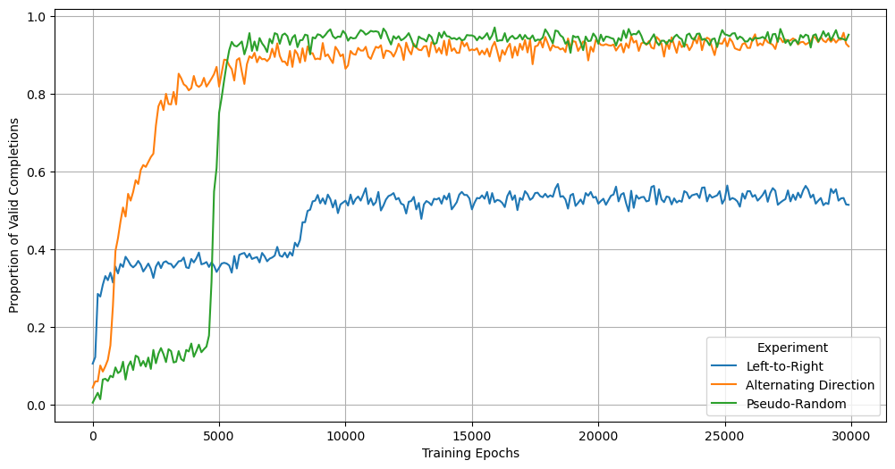

# Grokkiing experiments done with Random order AutoRegressive (ROAR) models on Sum Equalities

Data is valuable and finite. How much performance is lost when you only train right-to-left in your autoregressive models?

These experiments try to quantify this in the very simple case of two digit sum equalities. Sum equalities take the form a±b==c±d. Two sets of numbers are added together to make the same sum. 93-32==? has many possible answers. This is more complex that most grokking tasks and requires that the model learn the underlying structure of the sequence.

We can easily test if the model has learned the underlying structure of the data by checking if models prompted with a±b==? successfully complete the sequences such that a±b==c±d.

# Results: Proportion of Sequence Completions Which are Valid by Training Strategy

