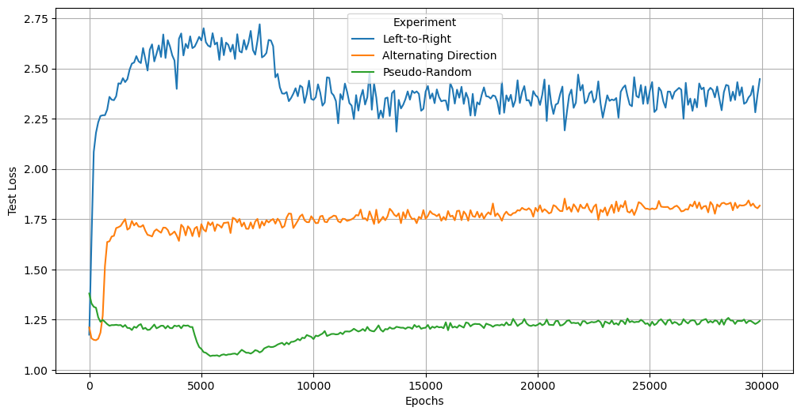

# Grokking experiments done with Random Order AutoRegressive (ROAR) models on Sum Equalities

Data is valuable and finite. How much performance is lost when you only train right-to-left in your autoregressive models?

These experiments try to quantify this in the very simple case of two digit sum equalities. Sum equalities take the form a±b==c±d. Two sets of numbers are added together to make the same sum. 93-32==? has many possible answers. This is more complex that most grokking tasks and requires that the model learn the underlying structure of the sequence.

We can easily test if the model has learned the underlying structure of the data by checking if models prompted with a±b==? successfully complete the sequences such that a±b==c±d.

We explore 3 sequence order traversals. 
* Conventional left-to-right training.
* Alternating left-to-right and right-to-left
* Pseudo random sequence order traversal where the "next" token in the random sequence is likely to be located near the "previous" token in the original unscrambled sequence

# Results: Proportion of Sequence Completions Which are Valid by Training Strategy

We observe that left-to-right training leaves a significant amount of potential performance on the table given a finite amount of data. Forcing the model to learn a more comprehensive model of the structure of its training data improves performance even when the model is only evaluated left-to-right.

# Left-to-Right Test Loss During Training

The proportion of samples completed in a valid way is almost uncorrelated with test loss, though sharp drops can be observed when phase changes occur.

# Model L2 During Training

More complex sequence traversal orders are more difficult to learn initially.
